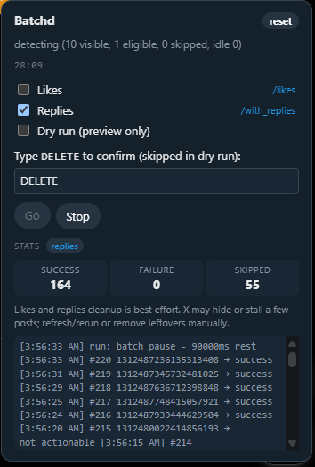

<p align="center">
  
</p>

<h1 align="center">Batchd</h1>

<p align="center"><strong>Bulk-delete your own X.com (Twitter) likes and replies, from your browser, with a click.</strong></p>

<p align="center">
  <a href="LICENSE"></a>
  <a href="https://github.com/11sid11/Batchd/releases"></a>
  <a href="https://github.com/11sid11/Batchd/stargazers"></a>
  <a href="https://github.com/11sid11/Batchd/issues"></a>
</p>

<p align="center"></p>

<p align="center">
  <a href="#quick-start"></a>
  &nbsp;
  <a href="https://github.com/11sid11/Batchd/releases/latest/download/batchd.user.js"></a>
  &nbsp;
  <a href="https://github.com/11sid11/Batchd/releases"></a>
</p>

<br>

Batchd is a small [Tampermonkey](https://www.tampermonkey.net/) userscript
that walks your **Likes** tab (`/likes`) and your **Replies** tab
(`/with_replies`) on x.com and removes the engagement, one post at a time,
with careful pacing so X's anti-abuse systems stay quiet. No API token,
no account credentials, no upload of your data anywhere — the script runs
entirely in your already-logged-in browser.

If you want to clean up years of "hearted" posts, or wipe the replies you
regretted, Batchd is the tool.

## 📑 Contents

- [Why this tool](#why-this-tool)
- [Features](#features)
- [Quick start](#quick-start)
- [Safety](#safety)
- [Browser compatibility](#browser-compatibility)
- [How it works](#how-it-works)
- [Compare to alternatives](#compare-to-alternatives)
- [Limitations](#limitations)
- [Development](#development)
- [License](#license)

## 🧹 Why this tool

Most "bulk delete" tools for X are paid SaaS dashboards that ask for your
account credentials or an OAuth token and then act on your behalf from a
server. That has three problems:

- **You have to trust a third party with full account access.**
- **Your data passes through someone else's server.**
- **They cost money.**

Batchd is the alternative: a single JavaScript file you install in
Tampermonkey that runs in the browser tab you're already logged in to. It
reads post IDs from the rendered timeline and clicks the existing on-screen
controls. Your session cookie is reused, your data never leaves your
machine, and there's nothing to pay for.

## ✨ Features

- 💔 **Bulk unlike X.com posts** — walks `/likes` and unlikes each visible post
- 🗑️ **Bulk delete X.com replies** — walks `/with_replies` and drives the
  more-menu → Delete → confirm sequence
- 🔐 **No API token, no OAuth, no credentials** — uses your existing browser
  session
- 🛡️ **No data leaves your machine** — no server, no upload, no telemetry
- 📖 **Open source (MIT)** — read the code, fork it, run it on your own data
  without trusting anyone
- ⏱️ **Pacing controls** — adjustable base delay, jitter, batch pause, and
  exponential backoff to stay under X's anti-abuse radar
- 🧪 **Dry-run mode** — walks the timeline and logs what it *would* click
  without actually clicking, so you can verify it sees the right posts
- 🔄 **Resumable** — the script remembers which posts it has already processed
  and skips them on subsequent runs
- ⚖️ **Per-category pacing** — likes are faster (1200ms base) because unliking
  is cheap; replies are slower (3000ms base) because delete is destructive
  and X treats it more strictly
- ⏲️ **Stopwatch** — see how long the run has been going
- ⏹️ **Stop button** — abort mid-run without losing progress
- 🧭 **One-click navigation** — `→ /likes` and `→ /with_replies` links in the
  panel take you to the right tab automatically

## 🚀 Quick start

Pick whichever install path matches your browser:

**Option A — 🌐 Chrome Web Store extension (v0.3.1+, recommended on Chrome):**

1. Open the [Batchd Chrome Web Store listing](#) and click **Add to
   Chrome**. *(Link goes live once the v0.3.0 submission is approved by
   the Chrome Web Store review team.)*
2. Go to x.com in a regular tab (logged in to the account whose
   likes/replies you want to delete).
3. A small panel appears in the bottom-right corner of every x.com page.
   Tick the mode you want (**Likes** is on by default), navigate to the
   right tab via the `→ /likes` or `→ /with_replies` link, type `DELETE`
   to confirm, and click **Go**.

**Option B — 🐵 Tampermonkey (Firefox, Safari, Edge, or any other browser):**

1. **Install Tampermonkey** in your browser:
   [Chrome](https://chrome.google.com/webstore/detail/tampermonkey/dhdgffkkebhmkfjojejmpbldmpobfkfo),
   [Firefox](https://addons.mozilla.org/en-US/firefox/addon/tampermonkey/),
   [Edge](https://microsoftedge.microsoft.com/addons/detail/tampermonkey/iikmkjmpaaaobklfaelallbbmhjblohk),
   or any other browser that supports userscripts.
   ([Violentmonkey](https://violentmonkey.github.io/) also works.)
2. **Install the script**: open `dist/batchd.user.js` from this repo, or
   drag-and-drop it into a browser tab. Tampermonkey will prompt to
   install. Approve.
3. Go to x.com (same logged-in-account requirement as Option A).
4. Same panel appears; same `DELETE` → **Go** flow.

That is the whole flow. The script will scroll the timeline, unlike/delete
each visible post one at a time, and stop when the timeline is exhausted
(or when you hit Stop).

## ⚠️ Safety

> ⚠️ **This script permanently deletes engagement from your X.com
> account. There is no undo.**

- **Likes** are recoverable (you can re-like a post later if you find it
  in your history, though the script does not track which posts it
  unliked).
- **Replies** are *not* recoverable. Once a reply is deleted, the text and
  the thread context are gone for everyone who saw them.

Before a real run:

1. **Run in dry-run mode first** (tick the **Dry run** checkbox). The
   script will walk the timeline and log every post it *would* click,
   without actually clicking. Verify the panel log shows the kind of
   posts you expect.
2. **Try a small slice** before committing to a multi-hour run. Untick
   Dry run, leave the panel running for a few minutes, and watch the
   stats to make sure the success counter is going up.
3. **The Go button requires you to type `DELETE`** before it will start.
   This is the only guardrail. If a young child or a curious cat has
   access to your browser, lock the panel behind your OS screen lock.

The script also does not handle the case where someone is logged in to
multiple X accounts in the same browser — it operates on whichever
account is currently signed in.

## 🌐 Browser compatibility

| Browser | Works? |
|---------|--------|
| Chrome (extension — v0.3.1+) | ✅ — preferred Chrome install path |
| Chrome (Tampermonkey) | ✅ |
| Firefox (Tampermonkey or Violentmonkey) | ✅ |
| Edge (Tampermonkey) | ✅ |
| Safari (Tampermonkey) | ✅ |
| Opera (Tampermonkey) | ✅ |
| Brave (Tampermonkey) | ✅ |
| Mobile browsers | ❌ — needs a desktop userscript manager or Chrome desktop |

## 🔧 How it works

Batchd ships as two install paths — a Tampermonkey userscript and a
Chrome MV3 extension — both built from a single `src/` tree of ESM
modules concatenated by `scripts/build.js`. The userscript bundle
(`dist/batchd.user.js`) is around 78KB; the Chrome bundle
(`dist/extension/`) is similar.

The architecture is intentionally minimal:

<details>
<summary><strong>Show module-by-module breakdown</strong></summary>

**Shared logic modules (used by both install paths):**

- **`src/selectors.js`** — the only module that touches the X.com DOM.
  Three-signal fallback chains (X rotates testid attributes between
  front-end releases) for the unlike control, the more-menu trigger,
  the menu item, and the delete-confirm button. This is the file you
  patch if X changes a selector — one function per concern.
- **`src/run.js`** — the run loop. Identical structure for both Likes
  and Replies: refill loop, idle watchdog, batch pause, failure
  backoff. The only per-category inputs are the click action and the
  pacing preset.
- **`src/persist.js`** — state. Per-category stats (likes/replies),
  per-category cursors, shared processed set, two pacing presets.
  Includes migrations from the v0.1.0 state shape.
- **`src/failures.js`** — outcome classifier. Maps click results to one
  of eight kinds: `success`, `already_gone`, `not_actionable`,
  `network`, `rate_limited`, `captcha`, `unknown`, `stale`.
- **`src/pacing.js`** — pure functions for delay, batch pause, and
  exponential backoff.
- **`src/yield.js`** — coexistence guard. If a user has both the
  Tampermonkey userscript and the Chrome extension installed, the
  first to mount claims `window.__batchd` and the second bails with a
  one-time console message.
- **`src/entry.js`** — the shared bootstrap. `bootstrapBatchd()`
  wires the modules together so the chrome and tampermonkey entry
  points stay thin.
- **`src/safeCall.js`** — small helper for swallowing exceptions from
  optional DOM/storage calls.
- **`src/panel.js`** — the floating bottom-right control panel.

**Storage adapters (one per install path):**

- **`src/storage.gm.js`** — wraps `GM_getValue` / `GM_setValue`
  for Tampermonkey. Returns a `get` / `set` factory consumed by
  `src/batchd.user.js`.
- **`src/storage.chrome.js`** — wraps `chrome.storage.local` for the
  Chrome extension. Returns the same shape. Falls back gracefully when
  the chrome runtime reports `lastError`.

**Entry points:**

- **`src/batchd.user.js`** — the Tampermonkey entry. Wires the
  storage.gm.js adapter, calls `bootstrapBatchd()`.
- **`src/content.js`** — the Chrome extension entry. Wires the
  storage.chrome.js adapter, calls the same `bootstrapBatchd()`.

</details>

<br>

The full v0.3.0 architecture (why one `src/` tree with two build
targets) is captured in
[ADR 0004](docs/adr/0004-chrome-extension-with-unified-source.md).
For a glossary of terms used throughout the codebase, see
[`CONTEXT.md`](CONTEXT.md).

No network calls of any kind. The only cookies used are the ones your
browser already has for x.com.

## 🆚 Compare to alternatives

There are several other tools for cleaning up your X.com history. Here is
how Batchd compares:

<details>
<summary><strong>Show full comparison table</strong></summary>

| Tool | What it does | Account access | Open source | Cost | X.com likes | X.com replies |
|------|--------------|----------------|-------------|------|-------------|---------------|
| **Batchd** (this project) | Bulk unlike + bulk delete replies | Uses your browser session, no credentials shared | ✅ MIT | Free | ✅ | ✅ |
| [Semiphemeral](https://www.semiphemeral.com/) | Auto-archive old tweets after N days | OAuth | ❌ | Paid | ❌ (archives only) | ❌ |
| [Redact](https://redact.dev/) | Bulk delete tweets, retweets, likes | OAuth | ❌ | Paid | ✅ | ❌ |
| [TweetDelete](https://tweetdelete.net/) | Bulk delete with date/keyword filters | OAuth | ❌ | Paid (free tier limited) | ❌ | ❌ |
| [TweetEraser](https://www.tweeteraser.com/) | Bulk delete + unlike | OAuth | ❌ | Paid | ✅ | ❌ |
| [Semiphemeral-likes](https://github.com/...) | Various open-source forks, mostly unmaintained | Varies | ✅ | Free | ✅ | ❌ |
| X.com native "archive / delete" UI | One at a time, in the browser | N/A (manual) | N/A | Free | ❌ (no bulk) | ✅ (one at a time) |

</details>

<br>

**Why Batchd is different:**

- 🔒 **No credentials, no server.** Nothing leaves your machine. The paid
  SaaS tools all require you to grant OAuth access, which means your
  tweets, DMs, and account metadata are processed on their servers
  (read their privacy policies).
- 👁️ **Open source.** You can read the full code, audit it, fork it,
  modify it for your own needs, and contribute back.
- 💬❤️ **Likes *and* replies.** Most tools only handle one. Batchd handles
  both, with a different pacing profile per category because deleting
  a reply is more sensitive than unliking a post.
- 💾 **Resumable.** If you close the tab or hit Stop, the script remembers
  which posts it has already processed and resumes from the saved
  cursor on the next run.
- 🌍 **Open and free, forever.** No free tier that suddenly becomes paid,
  no acquisition risk, no shutdown risk.

## 🚧 Limitations

- **Reposts and quote reposts are not supported.** X's "Undo repost" UI
  is unreliable and the prior Batchd implementation that handled them
  was removed. Restoring that flow needs a new design pass.
- **Non-reply tweets are not supported.** The "Tweets" tab of your
  profile is not bulk-deletable from this script — only the "Replies"
  tab is. (You can still delete individual tweets via X's native UI.)
- **DMs and bookmarks are not touched.**
- **One account at a time.** The script operates on whichever X.com
  account is currently logged in to your browser.
- **Pacing is not magic.** X's anti-abuse systems are a moving target.
  If you run too aggressively (low delay, no batch pause), the script
  may hit rate limits or captcha. The defaults are conservative; if you
  see captcha, stop, wait, and run again with default pacing.

## 🛠️ Development

```sh
git clone https://github.com/11sid11/Batchd.git
cd Batchd
npm install
npm test                   # runs the unit test suite (120 tests)
npm run build              # builds both artifacts: userscript + extension
npm run build:userscript   # dist/batchd.user.js only
npm run build:extension    # dist/extension/ only (manifest + content.js + icons/)
npm run icons              # regenerates extension/icons/*.png from assets/logo.svg
```

The build output for Tampermonkey is `dist/batchd.user.js`; for the
Chrome extension it's `dist/extension/`. Both are emitted from the same
`src/` tree. The `src/` files are ESM modules and not directly runnable.

Tests use `node --test` against the source modules with mocked DOM
(`src/selectors.js` is the main DOM-touching file; the others are pure
logic). 120 test cases cover pacing, persistence, the run loop, the
storage adapters, the yield guard, selector behavior, and the two
build-script bundle smoke tests (chrome extension + TM userscript).

This is a personal-use tool. Contributions are welcome — open an issue
first if you want to discuss a change larger than a small fix.

## 🏗️ Stack

<p>
  
  &nbsp;
  
  &nbsp;
  
  &nbsp;
  
  &nbsp;
  
  &nbsp;
  
</p>

## 📄 License

[MIT](LICENSE). Use it, fork it, ship it. Attribution appreciated but
not required.
